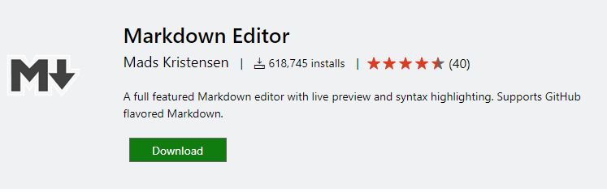

# Hello Markdown in VS Code!

This is a simple introduction to compiling Markdown in VS Code.

Things you'll need to do this well.

* [node](https://nodejs.org)
* [markdown-it](https://www.npmjs.com/package/markdown-it)
* [tasks.json](/docs/editor/tasks)

## Section Title

> This block quote is here for your information.



a | b
- | -
0 | 1


+---------+---------+
| Header  | Header  |
| Column1 | Column2 |
+=========+=========+
| 1. ab   | > This is a quote
| 2. cde  | > For the second column 
| 3. f    |
+---------+---------+
| Second row spanning
| on two columns
+---------+---------+
| Back    |         |
| to      |         |
| one     |         |
| column  |         | 

Term 1
:   This is a definition item
    With a paragraph
    > This is a block quote

    - This is a list
    - with an item2

    ```java
    Test


    ```

    And a last line
:   This ia another definition item

Term2
Term3 *with some inline*
:   This is another definition for term2
.


```nomnoml
[example|
  propertyA: Int
  propertyB: string
|
  methodA()
  methodB()
|
  [subA]--[subB]
  [subA]-:>[sub C]
]
```
.

sequenceDiagram
    participant Alice
    participant Bob
    Alice->John: Hello John, how are you?
    loop Healthcheck
        John->John: Fight against hypochondria
    end
    Note right of John: Rational thoughts <br/>prevail...
    John-->Alice: Great!
    John->Bob: How about you?
    Bob-->John: Jolly good!


gantt
dateFormat  YYYY-MM-DD
title Adding GANTT diagram to mermaid

section A section
Completed task            :done,    des1, 2014-01-06,2014-01-08
Active task               :active,  des2, 2014-01-09, 3d
Future task               :         des3, after des2, 5d
Future task2               :         des4, after des3, 5d