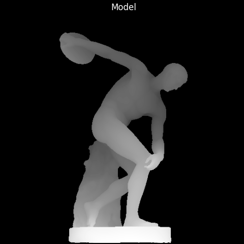
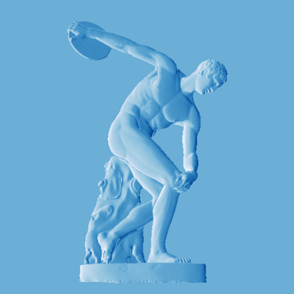
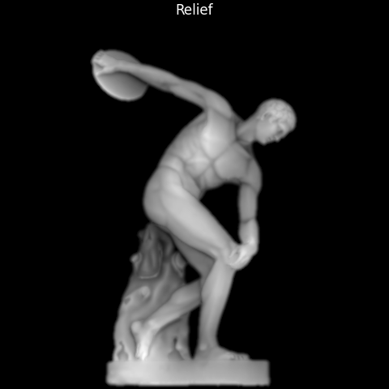
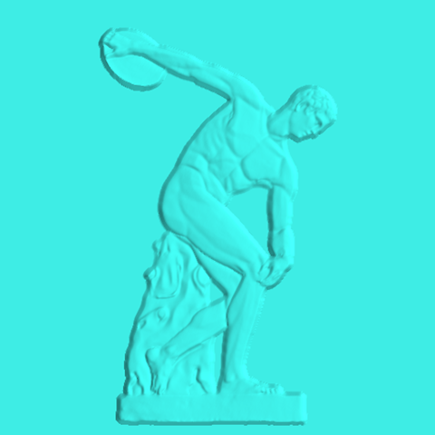

# ModelRelief

ModelRelief is a tool to create a bas-relief (sculptural low relief) from a 3D model.   

ModelRelief uses image processing to selectively compress the height variations (gradients) in a 3D model.
## About
ModelRelief is a tool for scultural designers who create low-reliefs from 3D models.  

### Linear Scaling Loses Detail
A 3D model cannot be linearly scaled to the desired depth because it removes detail. For example, simply scaling a 3D model produces this unsatisfying result.

|3D Model|Linear Scaling|
|-|-|
|||

### Image Domain Processing Preserves Detail
Instead, better definition of detail can be realized by manipulating the model in the image domain. A depth buffer (height map) is transformed as an image to selectively reduce slopes (gradients) in the image and amplify other features. 

|Depth Buffer|Gradient Processing|Depth Buffer (Transformed)|
|-|-|-|
||||

The result is a much better representation of the original model.


## Technology

ModelRelief was developed under Ubuntu 20.04 using [Windows Subsystem for Linux](https://docs.microsoft.com/en-us/windows/wsl/about).

The web site front end uses [TypeScript](https://www.typescriptlang.org/) and [Three.js](https://threejs.org/) to compose depth buffers from OBJ models.  

The web site back end is written in [C#](https://docs.microsoft.com/en-us/dotnet/csharp/) and [ASP.NET Core 3.1](https://docs.microsoft.com/en-us/aspnet/core/?view=aspnetcore-3.1).  

Solver is written in [Python](https://www.python.org/) with several C++ extensions.  

The Explorer desktop tool uses [Mayavi](https://docs.enthought.com/mayavi/mayavi/).
### Solver
Solver is a Python-based tool to transform depth buffers. It uses PyAMG (Algebraic Multigrid) to solve Poisson's equation to construct the best approximate surface for the transformed grdients. Solver is the back-end to Explorer, a desktop workbench for experimentation.


### ModelRelief Web Site
The ModelRelief web site [www.modelrelief.org](https://www.modelrelief.org/) is a simple web front-end to Solver. You can create a free account and experiment with the sample models or upload your own OBJ 3D models.


## Additional Information

|Description|Document|
|--|--|
|Implementation and technical notes|[TechnicalNotes.md](./ProjectNotes/TechnicalNotes.md)|
|Planned enhancements and new features|[Enhancements.md](./ProjectNotes/Enhancements.md)|
|Checklists and guides for development tasks|[Procedures.md](./ProjectNotes/Procedures.md)|
|Known problems and open issues|[Issues.md](./ProjectNotes/Issues.md)|

## Development
###  Linux Setup
#### git
```
sudo apt install git
git clone https://github.com/steveknipmeyer/ModelRelief.git

# Pull and initialize Pybind11 and Catch2 repos used for the Python C++ relief extension.
git submodule init
git submodule update
```    
#### .NET Core 3.1 SDK  
Follow the instructions to install the .NET 3.1 SDK here:   
https://docs.microsoft.com/en-us/dotnet/core/install/linux-ubuntu

Also install the CLI extensions for Entity Framework.
```
dotnet tool install --global dotnet-ef
```

#### C++
Install standard tools for building C++, used for the Python relief extension.
```
sudo apt-get install build-essential gdb
``` 
#### CMake
Install the make tools used for bulding the Python relief extension.
```
sudo apt install cmake
``` 

#### Node.js
````
sudo apt install nodejs
````
#### NPM 
````
sudo apt install npm
npm install
# gulp tasks
sudo npm install --global gulp-cli
# TypeScript circular depedency tool
sudo npm install --global madge
# SASS compiler
sudo npm install --unsafe-perm -g node-sass
````
#### SQLite Database
```
sudo apt-get install sqlite3 (if required)
sudo apt-get install sqlitebrowser
```
#### Python
```
# Python virtual enviroment
sudo apt-get install python3-venv
# development tools
sudo apt install python3-dev

```  
#### Runtime
Create azurekeyvault.json in the ModelRelief folder. See the [Azure Key Store](./ProjectNotes/TechnicalNotes.md#azure-key-store) in [TechnicalNotes.md](./ProjectNotes/TechnicalNotes.md) for the expected key-value pairs.
```json
{
  "AzureKeyVault": {
    "Vault": "Your Vault Id",
    "ApplicationId": "Your Application Id",
    "ModelReliefKVKey": "Your Client Secret"
  }
}
```
#### Python Virtual Environment
Build the Python development environment.
```
Build/BuildPythonEnvironment.sh Development devenv
```
Activate the environment.
```
. devenv/bin/activate
```

#### ModelRelief DevelopmentShell
Set up your development environment by invoking [ModelReliefShell.sh](./Tools/ModelReliefShell.sh). You will probably want to do this as part of your login initialization. 
```
. ./Tools/ModelReliefShell.sh
```
###  Building ModelRelief
#### Build
```
python Build/Builder.py --target local
``` 
#### Test Suite
```
python Tools/testrunner.py
``` 
## Usage
The [ModelRelief](https://www.modelrelief.org/) web site allows OBJ 3D models to be converted into low reliefs. 

First, a view of the 3D model is composed to define the viewing angle. Then a set of processing parameters are adjusted to control the generation of the low relief. The result is an OBJ mesh that may be downloaded for additional processing.

## REST API
The REST API is summarized here: [ModelRelief API](https://www.modelrelief.org/api/v1/documentation/index.html)
## Contributing
ModelRelief is freely shared through an MIT open source license. However, contributions are not being  accepted now due to limited resources.
## Credits

ModelRelief is based on the work of [Dr. Jens Kerber](https://www.linkedin.com/in/jens-kerber-30ba4b94/?originalSubdomain=de).   
The algorithms are taken from Dr. Kerber's paper [Digital Art of Bas-Relief Sculpting](https://citeseerx.ist.psu.edu/viewdoc/download?doi=10.1.1.230.1722&rep=rep1&type=pdf)

For additional credits, please see the [Technical Credits](https://www.modelrelief.org/home/credits) page on the ModelRelief site.
## License
ModelRelief is open source with an MIT license.

[MIT](./MIT-License.txt)

